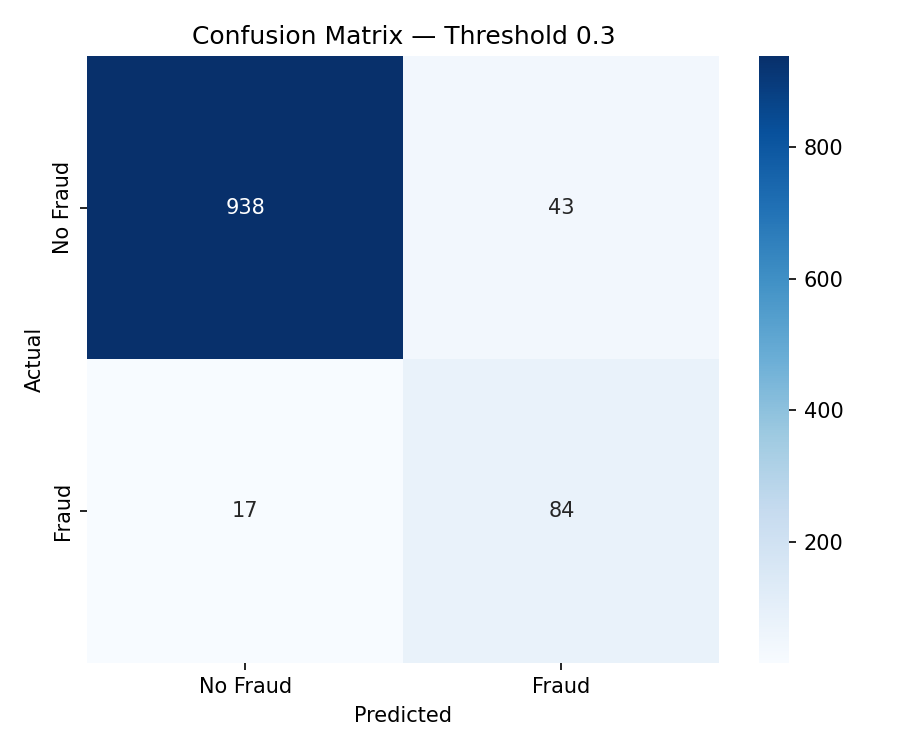
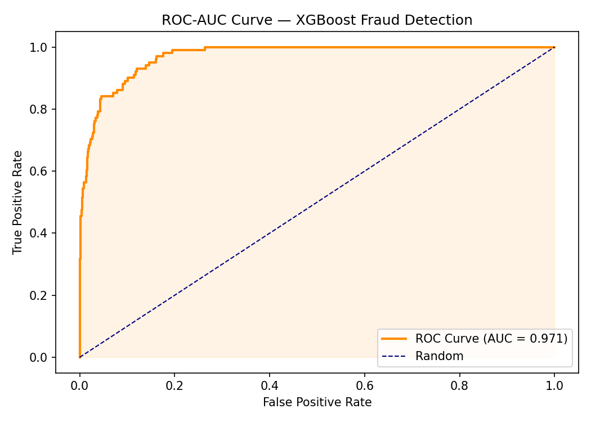
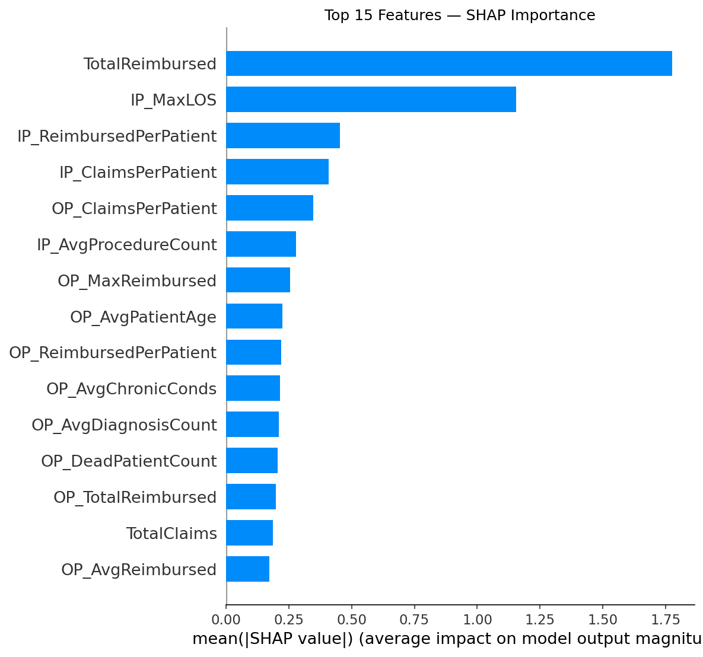
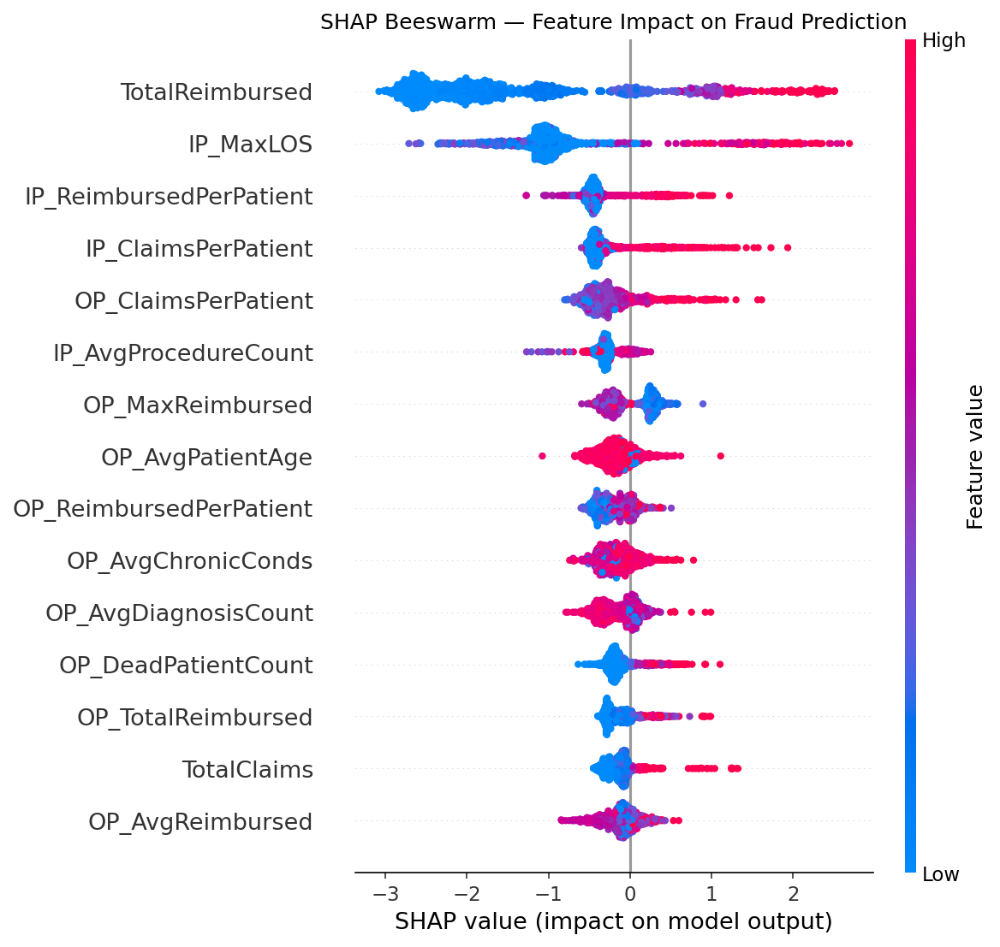

# 🔍 Health Insurance Fraud Detection

## 🚀 Live Demo
👉 [Launch App](https://fraud-detection-mm24vn8vupbdnps6amvr5q.streamlit.app)

## 📊 Model Performance
| Metric | Score |
|--------|-------|
| ROC-AUC | **97.1%** |
| Recall (Fraud class) | **83.2%** |
| Precision (Fraud class) | **66.1%** |
| Training Claims | 558K+ |
| Providers | 5,410 |

## 📌 Project Summary
Engineered provider-level features from 558K+ Medicare claims to detect 
fraudulent insurance providers using XGBoost — deployed as an interactive 
Streamlit app with SHAP explainability.

## 🧠 Key Insights
- Fraudulent providers file **13x more claims** per provider
- Top fraud signals: TotalReimbursed, IP_MaxLOS, IP_ClaimsPerPatient
- SHAP explainability shows exactly why each provider is flagged

## 🛠 Tech Stack
- XGBoost + SHAP + Streamlit + pandas + scikit-learn
- CMS Medicare Provider Utilization Dataset (558K+ claims)
- 41 engineered provider-level features

## 📈 Model Visuals

